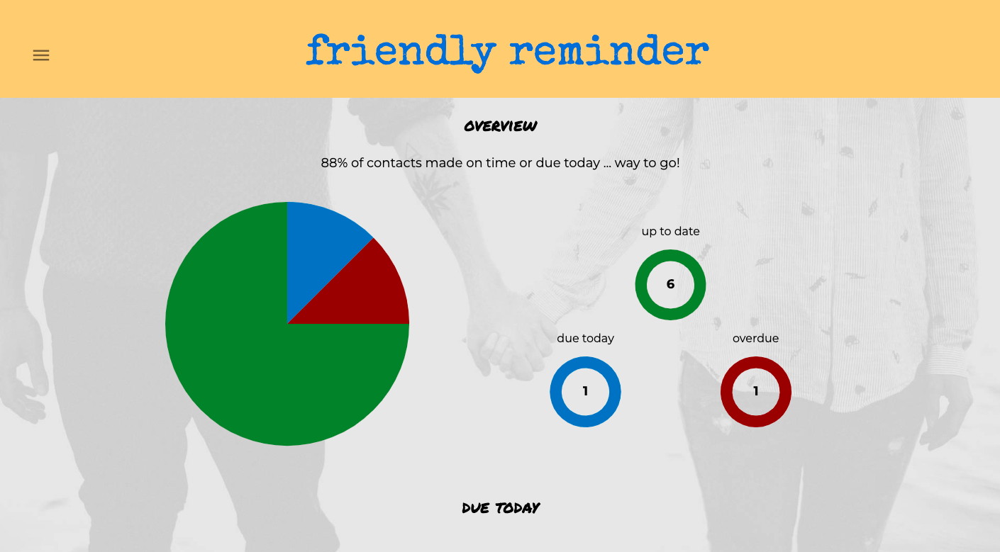

# Friendly Reminder

Friendly Reminder is a web application designed to make it easy to keep up with friends on a regular basis.

Available for use here: [https://tgroselyn-friendly-reminder.herokuapp.com/](https://tgroselyn-friendly-reminder.herokuapp.com/)

For many of us, there are simply too many people in our lives to keep up with, and too often the ones we care about most slip through the cracks. Moreover, many of my contacts are really only available through specific channels. Certain people I contact only through email, or only through text messaging, or only through a social media network like Facebook or LinkedIn.

I built Friendly Reminder to solve these problems. After creating an account, I am able to set up each contact with multiple contact addresses, including a preferred contact method. I will also set a frequency for each, or how many days should pass before I'm reminded again to get in touch.

## Built With

Friendly Reminder was built with React, Redux Sagas, Node, Express, and PostgreSQL. It also uses Material-UI for styling, Sweet Alerts for pop-up alerts, and Nodemailer and Twilio for sending emails and SMS messages from the app.

## Getting Started

These instructions will get you a copy of the project up and running on your local machine for development and testing purposes.

### Prerequisites

- [Node.js](https://nodejs.org/en/)
- [PostgresQL](https://www.postgresql.org/)
- [Postico](https://eggerapps.at/postico/)

### Installing

Steps to get the development environment running.

1. Download this project.
2. Set up a local PostgreSQL database called `friendly_reminder`
3. Use the database.sql instructions to create a table in your database
4. Set up a local .env file with the following fields, replacing values in parentheses with your own:
    a. SERVER_SESSION_SECRET=(32-character string including symbols)
    b. email_user=(gmail account to send messages from)
    c. email_pass=(gmail account password, two-factor authentication won't work here)
    d. sms_accountSid=(twilio account sid - optional, if using SMS router)
    e. sms_authToken=(twilio auth token - optional, if using SMS router)
5. In the terminal, `npm install` in the project folder
6. In the terminal, `npm run server` in one tab and `npm run client` in another

## Screen Shot

## Documentation

### Completed Features

App allows users to

- [x] Create an account and sign in
- [x] Add friends with specific contact method and frequency preferences
- [x] See friends due today and overdue from the dashboard view
- [x] Use a friend's preferred contact method or delay their due date directly from the dashboard
- [x] From the All Friends view, use any contact method, edit or delete a friend
- [x] Send emails and text messages directly from within the app

### Next Steps

- [ ] Allow account editing and deletion
- [ ] Build a more advanced table, with sorting options, in the All Friends view
- [ ] Reformat outgoing email and text messages for ease of understanding
- [ ] Improve user registration - validate information
- [ ] Port to mobile-first web app or platform-native app
- [ ] Use Material-UI theme for consistency and ease of updating

## Authors

* Thomas Roselyn

## Acknowledgments

* Prime Digital Academy
